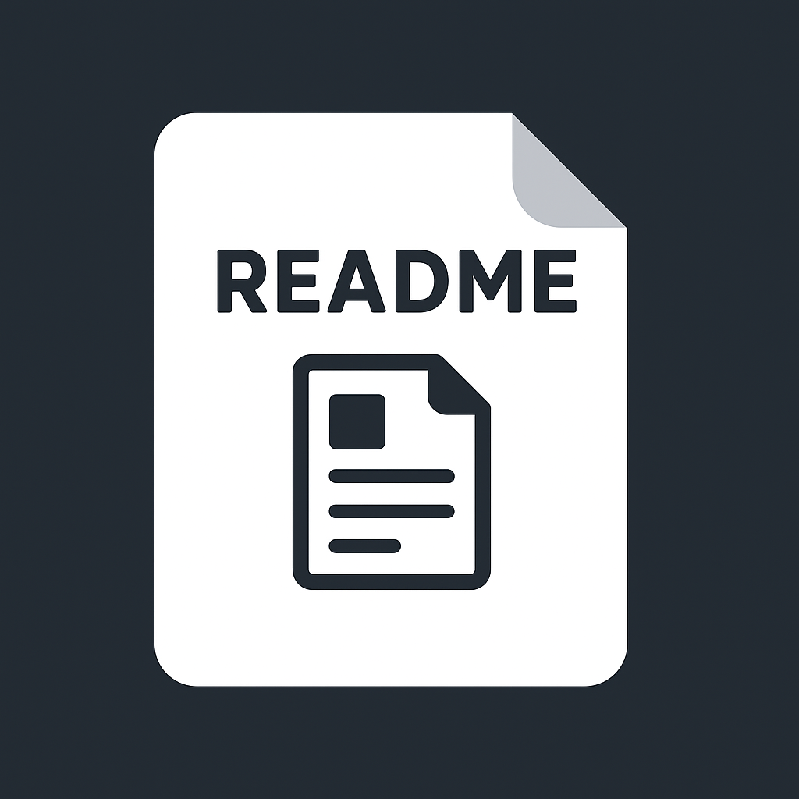

<div align="center">
  
  
  # Readme Generator
  
  **VS Code extension to automatically generate README.md with project structure and detected technologies**
  
  [](https://nodejs.org/)
  [](https://github.com/jochylazala/readme.md-generator)
  [](https://marketplace.visualstudio.com/items?itemName=jochylazala.readme-generator-jochylazala)
  [](https://marketplace.visualstudio.com/items?itemName=jochylazala.readme-generator-jochylazala)
</div>

---

## 📖 Description

**Readme Generator** is a Visual Studio Code extension designed to **automatically generate README.md files** showing the project structure, detected technologies, and available scripts.  

> 🎯 **Mission**: Save developers time by automatically generating initial project documentation.  
> 🚀 **Vision**: Become the standard tool for creating clear and organized README.md files for any project.  
> 🌱 **Motivation**: Many projects lack an initial or well-structured README; this extension automates that task and promotes best practices.

---

### 📊 Project Stats

- 📝 **Lines of code**: ~400+ TypeScript lines
- ⚡ **Detected frameworks**: React, Next.js, NestJS, Express, TypeORM, Prisma, TypeScript, PostgreSQL, SQLite
- 🚀 **Performance**: Fast README.md generation in seconds
- 🎨 **VS Code Extension**: Compatible with all recent versions

---

### ✨ Key Features

- 📂 **Automatically detects folder structure**
- ⚙️ **Lists technologies** based on `package.json` dependencies
- 📝 **Generates clean and organized README.md**
- 🚀 **Supports multiple stacks**: Node.js, TypeScript, React, Next.js, NestJS, Express
- 🔧 **Available scripts**: Lists commands defined in `package.json`
- 🎨 **Icons and emojis** for better visualization

---

## 🚀 Installation

### Prerequisites
- [Node.js](https://nodejs.org/) (v18+ recommended)
- Git
- VS Code

### Install from VS Code Marketplace

<div align="center">
  <a href="https://marketplace.visualstudio.com/items?itemName=jochylazala.readme-generator-jochylazala">
    
  </a>
  <br>
  
</div>

```bash
# Install the extension directly
code --install-extension jochylazala.readme-generator-jochylazala
